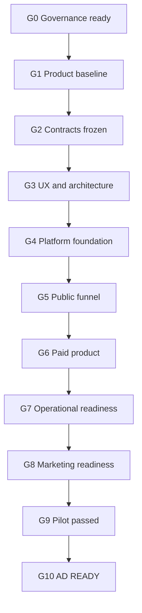

# BizMetria Delivery Roadmap

**Task:** `MC-002 — Delivery Roadmap and Phase Gates`  
**Status:** `APPROVED` \
**Owner:** Master Orchestrator  
**Last updated:** 2026-07-30  
**Verified approval `main` SHA:** `713c17e2ca854ce65125d65382dedee3fcec6d9c` \
**Historical planning branch:** `task/ws-01/MC-002-delivery-roadmap` \
**Approval evidence:** PR [#3](https://github.com/Bear78888/bizmetria.ai/pull/3)

## Purpose

This is the canonical dependency-ordered plan for taking BizMetria from the approved governance baseline to a production system that is ready for controlled advertising.

The roadmap covers:

- the bilingual public website;
- the free AI Opportunity Check and deterministic score;
- lead capture, consent, CRM, email, SMS, and payment;
- the paid questionnaire and English/Spanish voice interviews;
- AI analysis, recommendation logic, prompts, and evaluation;
- human review, report generation, PDF delivery, and consultation;
- administration, legal/privacy/security, analytics, monitoring, backups, and support;
- marketing content, sales scripts, pilot testing, and controlled advertising.

The roadmap is a delivery plan, not approval of unresolved commercial, legal, vendor, or policy choices. Those choices remain open until recorded through the Decision Log and the applicable gate.

## Non-negotiable product constraints

- The paid BizMetria Business Assessment costs **$299 one time** and is not a subscription.
- Implementation is sold separately and is not included in $299.
- Cold traffic begins with the free **AI Opportunity Check**.
- The free result provides limited value and does not expose the paid analysis, implementation design, full roadmap, PDF, or consultation.
- English and Spanish are launch languages with separate telephone numbers and one shared backend.
- English and Spanish use the same canonical IDs and output contracts.
- The AI Opportunity Score is deterministic, ranges from 0 to 100, and keeps block caps of 30/25/20/15/10.
- Industry, contact data, language, and promotion code do not affect the score.
- Stripe Coupons and Promotion Codes support discounts from $49 to $199 off.
- The $199 discount is reserved for late reactivation and is not advertised in advance.
- Every paid MVP report requires human approval before delivery.
- Unsupported financial-loss estimates, guaranteed results, and unapproved delivery claims are prohibited.

## Delivery operating rules

1. Merged `main` is the only approved repository state.
2. One task uses one temporary branch and one draft PR.
3. A dependent task does not start until every required upstream result is merged and verified.
4. Default work-in-progress limit: no more than two execution tasks plus one PR review at the same time.
5. Parallel tasks must have non-overlapping file scopes and no unresolved input dependency.
6. Every task has an owner, exact inputs, target artifact or implementation, acceptance criteria, validation evidence, and Handoff Summary.
7. Product, policy, legal, and vendor proposals remain proposals until the authorized gate approves them.
8. Secrets, production personal data, credentials, and payment-card data are never committed.
9. A phase is complete only when its exit gate is recorded as passed.
10. Advertising cannot start until the final `AD READY` gate passes.

## Status vocabulary

- `PLANNED` — defined but dependencies are not yet satisfied.
- `READY` — dependencies are merged and no live-lock exists.
- `IN PROGRESS` — a verified remote task branch owns the task.
- `REVIEW` — a draft PR is open.
- `APPROVED` — accepted and merged to `main`.
- `BLOCKED` — a named dependency or owner decision prevents progress.
- `PAUSED` — intentionally stopped with a recorded recovery point.

## Task ownership and target convention

| Prefix | Owning workstream |
|---|---|
| `MC` | 01 — Master Control |
| `PS` | 02 — Product Strategy |
| `UX` | 03 — Brand, Website and UX |
| `FA` | 04 — Free Audit and Lead Scoring |
| `EN` | 05 — English Voice Analyst |
| `ES` | 06 — Spanish Voice Analyst |
| `AE` | 07 — AI Analysis Engine |
| `RP` | 08 — Report and PDF System |
| `BE` | 09 — Backend, Data and Integrations |
| `LC` | 10 — Payments, CRM and Lifecycle |
| `LS` | 11 — Legal, Privacy and Security |
| `MS` | 12 — Marketing, Content and Sales |
| `QA` | 13 — QA, Analytics and Release |

The task prefix identifies its accountable workstream even where an individual executor is still `UNASSIGNED`. Documentation tasks name their intended artifact. Implementation tasks name the required system output; their exact source/test/infrastructure paths must be assigned after `BE-002` establishes the application structure and before the task branch is created.

## Gate model

## Phase overview

| Phase | Outcome | Primary gate |
|---:|---|---|
| 0 | Governance and canonical roadmap approved | `G0` |
| 1 | Product, policies, KPIs, and owner decisions fixed | `G1` |
| 2 | Versioned cross-system contracts approved | `G2` |
| 3 | UX, voice, technical architecture, and vendors approved | `G3` |
| 4 | Secure staging platform and development foundation operational | `G4` |
| 5 | Public website, free audit, lead capture, and checkout work end to end | `G5` |
| 6 | Paid questionnaire, voice, analysis, review, PDF, and consultation work end to end | `G6` |
| 7 | Operations, recovery, security, support, and reliability validated | `G7` |
| 8 | Analytics, launch assets, attribution, and campaign controls ready | `G8` |
| 9 | Controlled bilingual pilot completed without critical defects | `G9` |
| 10 | Controlled advertising launched and scale decision governed | `G10` |

# Phase 0 — Governance and roadmap

## `MC-001 — Master Orchestrator and Workstream Architecture Migration`

- **Status:** `APPROVED`
- **Result:** One Master Orchestrator, thirteen permanent GitHub workstreams, temporary task branches/chats, control documents, live-lock rules, and continuity policy.
- **Evidence:** PR [#2](https://github.com/Bear78888/bizmetria.ai/pull/2), merge SHA `473ee6c042bd5224bec75dbc18fa803e9b148aa3`.

## `MC-002 — Delivery Roadmap and Phase Gates`

- **Status:** `APPROVED`
- **Owner:** Master Orchestrator
- **Output:** This roadmap plus synchronized global and Workstream 01 state.
- **Dependencies:** `MC-001`.
- **Acceptance:** Every delivery phase, task, dependency, target, exit criterion, owner gate, and `AD READY` condition is explicit; no open product decision is silently resolved.
- **Target:** `docs/control/DELIVERY_ROADMAP.md`.
- **Evidence:** PR [#3](https://github.com/Bear78888/bizmetria.ai/pull/3), merge SHA `713c17e2ca854ce65125d65382dedee3fcec6d9c`.

## Gate `G0 — Governance Ready`

**Status:** `PASS` \
**Recorded:** 2026-07-30

Pass only when:

- `MC-001` is merged and verified;
- `MC-002` is reviewed and merged;
- the Decision Log, Project Status, Task Queue, Registry, Active Work, Master Continuation, and Workstream 01 state agree;
- `PS-001` and `LS-001` are the only initial execution assignments.

All four conditions were satisfied when G0 passed. `PS-001` and `LS-001` are `APPROVED` through PR #5 and PR #6; `PS-002` is `APPROVED` through PR #8. `MC-003` is active and blocked on explicit owner selections and required facts/reviews. No later task is authorized to start before its named dependencies and gate pass.

# Phase 1 — Product and policy baseline

The first concurrency window contains two non-overlapping tasks: `PS-001` and `LS-001`.

## `PS-001 — Product Blueprint v0.1`

- **Owner:** Product Strategy.
- **Dependencies:** `G0`.
- **Output:** Complete current Product Blueprint, explicitly presented as a new version rather than the unavailable historical original.
- **Target:** `docs/workstreams/02-product-strategy/BIZMETRIA_PRODUCT_BLUEPRINT_v0.1.md`.
- **Must define:** target customers, jobs, value proposition, free/paid boundary, customer journey, paid deliverables, bilingual model, implementation boundary, operating model, risks, metrics, and open decisions.
- **Acceptance:** All approved product constraints are preserved; proposals and approved facts are separated; every downstream workstream receives actionable inputs; Handoff Summary included.

## `LS-001 — Legal and Data Inventory Baseline`

- **Owner:** Legal, Privacy and Security.
- **Dependencies:** `G0` and the current recovered customer journey; it may run in parallel with `PS-001`.
- **Output:** Field-level data inventory, purpose/access/retention/deletion matrix, consent baseline, disclaimer inventory, policy issue register, and security-risk register.
- **Target:** `docs/workstreams/11-legal-privacy-security/deliverables/BIZMETRIA_LEGAL_DATA_BASELINE_v0.1.md`.
- **Acceptance:** Email and SMS permission are separate; data minimization is explicit; unresolved legal questions are flagged for qualified review; no document claims to be final legal advice.

## `PS-002 — Owner Decision Package`

- **Owner:** Product Strategy, coordinated by Master Orchestrator.
- **Dependencies:** merged `PS-001` and `LS-001`.
- **Output:** One decision package with options, tradeoffs, recommendation, and downstream impact for:
  - paid-report delivery deadline;
  - Refund Policy;
  - consultation format, duration, scheduling, and no-show rules;
  - implementation packages and prices;
  - promotion eligibility, cadence, expiration, and stacking;
  - MVP product KPIs and operational capacity assumptions.
- **Target:** `docs/workstreams/02-product-strategy/deliverables/BIZMETRIA_OWNER_DECISION_PACKAGE_v0.1.md`.
- **Acceptance:** Each question is answerable independently; no option is presented as approved before the owner chooses it.

## `MC-003 — Product Decision Gate`

- **Owner:** Product owner and Master Orchestrator.
- **Dependencies:** `PS-002`.
- **Output:** Explicit owner decisions recorded in the Decision Log; unresolved non-blocking items are deferred with an owner and trigger date.
- **Acceptance:** Checkout, fulfillment, consultation, refund handling, promotions, implementation boundary, and MVP KPIs have enough approved detail for implementation.

## `PS-003 — Product Requirements Baseline v1.0`

- **Owner:** Product Strategy.
- **Dependencies:** `MC-003`.
- **Output:** Product Blueprint and acceptance requirements updated to incorporate approved owner decisions.
- **Target:** `docs/workstreams/02-product-strategy/deliverables/BIZMETRIA_PRODUCT_REQUIREMENTS_v1.0.md`.
- **Acceptance:** No blocking commercial or operating ambiguity remains for Phase 2 contracts.

## Gate `G1 — Product Baseline Approved`

Pass only when `PS-003` is merged, blocking owner decisions are recorded, the legal/data baseline is available, and all downstream tasks can quote stable product requirements.

# Phase 2 — Canonical product and system contracts

Tasks may be paired only where their inputs and files do not overlap.

## `FA-001 — Free Audit and Score Contract`

- **Dependencies:** `G1`.
- **Output:** 11-question bilingual canonical schema, answer IDs, validation, deterministic point table, result-selection rules, locked-content boundary, and regression vectors.
- **Target:** `docs/workstreams/04-free-audit-lead-scoring/deliverables/BIZMETRIA_FREE_AUDIT_CONTRACT_v1.0.md`.
- **Acceptance:** Score always stays 0–100; block caps hold; identical inputs are deterministic; tests cover 0, 24/25, 44/45, 64/65, 79/80, and 100; English/Spanish semantic parity passes.

## `PS-004 — Paid Assessment Content Contract`

- **Dependencies:** `G1`.
- **Output:** Extended questionnaire, interview objectives, evidence requirements, required/optional fields, partial-completion behavior, completion criteria, and customer-facing scope.
- **Target:** `docs/workstreams/02-product-strategy/deliverables/BIZMETRIA_PAID_ASSESSMENT_CONTRACT_v1.0.md`.
- **Acceptance:** Supports the approved paid deliverables without collecting unnecessary data.

## `LS-002 — Consent, Claims, and Data Requirements`

- **Dependencies:** `G1`, `FA-001`, and `PS-004`.
- **Output:** Implementable consent texts/requirements, data lifecycle constraints, user-rights requirements, approved/prohibited claim matrix, and review triggers.
- **Target:** `docs/workstreams/11-legal-privacy-security/deliverables/BIZMETRIA_CONSENT_CLAIMS_REQUIREMENTS_v1.0.md`.
- **Acceptance:** Every customer-facing surface and stored data class has a requirement.

## `LC-001 — Commercial and Lifecycle Contract`

- **Dependencies:** `PS-003` and `LS-002`.
- **Output:** Pricing/discount rules, checkout states, CRM lifecycle, email/SMS trigger matrix, refund state, reactivation, consultation, and implementation-interest states.
- **Target:** `docs/workstreams/10-payments-crm-lifecycle/deliverables/BIZMETRIA_LIFECYCLE_CONTRACT_v1.0.md`.
- **Acceptance:** One-time $299 checkout, discount math, consent, expiration, stacking, failure, refund, and recovery cases are deterministic.

## `AE-001 — Analysis and Evidence Contract`

- **Dependencies:** `FA-001`, `PS-004`, and `LS-002`.
- **Output:** Normalized inputs/outputs, evidence/inference separation, recommendation model, confidence/uncertainty, prioritization, Impact vs. Effort rules, 30–90 day roadmap schema, and human-review handoff.
- **Target:** `docs/workstreams/07-ai-analysis-engine/deliverables/BIZMETRIA_ANALYSIS_CONTRACT_v1.0.md`.
- **Acceptance:** Every material claim is traceable; unsupported loss/guarantee generation is blocked; language-neutral output validates.

## `RP-001 — Report, Review, and Delivery Contract`

- **Dependencies:** `AE-001`, `PS-003`, and `LS-002`.
- **Output:** Report schema, bilingual rendering requirements, editorial rules, review states, versioning, delivery rules, and consultation handoff.
- **Target:** `docs/workstreams/08-report-pdf-system/deliverables/BIZMETRIA_REPORT_CONTRACT_v1.0.md`.
- **Acceptance:** Human approval is mandatory; long/missing content and bilingual fixtures are covered; report and source-analysis versions are auditable.

## `QA-001 — Requirements Traceability and Analytics Baseline`

- **Dependencies:** all Phase 2 contracts.
- **Output:** Requirements-to-test traceability matrix, initial event taxonomy, defect severity definitions, test-data policy, and release evidence format.
- **Target:** `docs/workstreams/13-qa-analytics-release/deliverables/BIZMETRIA_QA_ANALYTICS_BASELINE_v1.0.md`.
- **Acceptance:** Every contract requirement has an owner, test type, and measurable event or verification method.

## Gate `G2 — Contracts Frozen`

Pass only when Phase 2 contracts are merged, versioned, mutually consistent, and accepted by their downstream consumers. Schema-breaking changes after this gate require explicit versioning and impact review.

# Phase 3 — Experience, voice, architecture, and vendor decisions

## `UX-001 — Product Experience Architecture`

- **Dependencies:** `G2`.
- **Output:** Page/state inventory, bilingual flows, responsive/accessibility requirements, free-result boundary, checkout, paid assessment, voice, status, review, report, consultation, support, and recovery states.
- **Target:** `docs/workstreams/03-brand-website-ux/deliverables/BIZMETRIA_PRODUCT_EXPERIENCE_ARCHITECTURE_v1.0.md`.
- **Acceptance:** Every state has entry, action, success, failure, retry, analytics, and consent behavior.

## `EN-001 — English Voice Conversation Specification`

- **Dependencies:** `PS-004`, `AE-001`, and `LS-002`.
- **Output:** System behavior, prompt package, question/probe logic, canonical mapping, disclosure/consent, interruption/silence/retry behavior, structured outputs, and test calls.
- **Target:** `docs/workstreams/05-english-voice-analyst/deliverables/BIZMETRIA_ENGLISH_VOICE_SPEC_v1.0.md`.
- **Acceptance:** Required evidence is captured or marked missing; calls remain within the approved duration boundary; outputs validate.

## `ES-001 — Spanish Voice Localization and Parity Specification`

- **Dependencies:** `EN-001`.
- **Output:** Spanish prompt package, glossary, canonical mapping, regional wording notes, paired parity cases, and failure behavior.
- **Target:** `docs/workstreams/06-spanish-voice-analyst/deliverables/BIZMETRIA_SPANISH_VOICE_SPEC_v1.0.md`.
- **Acceptance:** Equivalent English/Spanish evidence yields equivalent structured outputs.

## `BE-001 — Technical Architecture and Vendor ADRs`

- **Dependencies:** `G2`; uses `UX-001`, `EN-001`, and `LC-001` before final approval.
- **Output:** Frontend/backend/database/hosting architecture, domain boundaries, integration map, environments, observability, security, backup, cost model, and replaceable vendor adapters.
- **Target:** `docs/workstreams/09-backend-data-integrations/deliverables/BIZMETRIA_TECHNICAL_ARCHITECTURE_v1.0.md`.
- **Acceptance:** Staging/production topology, failure paths, data boundaries, vendor replacement strategy, and MVP cost estimate are explicit.

## `MS-001 — Positioning and Message Matrix`

- **Dependencies:** `PS-003`, `UX-001`, and `LS-002`.
- **Output:** Audiences, problems, value claims, English/Spanish message parity, objections, prohibited claims, and offer hierarchy.
- **Target:** `docs/workstreams/12-marketing-content-sales/deliverables/BIZMETRIA_MESSAGE_MATRIX_v1.0.md`.
- **Acceptance:** Messaging matches the product and legal boundaries and does not expose the paid result for free.

## `MC-004 — Stack and Vendor Approval Gate`

- **Owner:** Product owner and Master Orchestrator.
- **Dependencies:** `BE-001`, `EN-001`, `LC-001`, and `RP-001`.
- **Decisions required:** hosting, database, AI/model provider, telephony, English/Spanish numbers, transcription, CRM/email, SMS, payment, PDF, analytics, monitoring, and support tooling.
- **Acceptance:** Each choice has cost, data handling, fallback, account owner, credential owner, and provisioning action; secrets remain outside GitHub.

## Gate `G3 — Build Architecture Approved`

Pass only when UX, voice specifications, technical architecture, vendor choices, cost envelope, and account-provisioning responsibilities are approved.

# Phase 4 — Platform foundation

## `BE-002 — Application and Environment Foundation`

- **Dependencies:** `G3`.
- **Output:** Application repository structure, development/staging/production configuration, CI/CD, migrations, secret references, domain/DNS/SSL plan, and deployment runbook.
- **Acceptance:** A clean environment can build, test, migrate, and deploy to staging without manual source edits.

## `BE-003 — Core Domain, API, Events, and State Machines`

- **Dependencies:** `BE-002` and `G2` contracts.
- **Output:** Customer, lead, audit, order, payment, assessment, interview, analysis, review, report, consultation, promotion, and lifecycle models; APIs/events; retries; idempotency; audit trail.
- **Acceptance:** Contract tests cover valid, invalid, duplicate, delayed, and recovery transitions.

## `UX-002 — Design System and Production UI Specification`

- **Dependencies:** `UX-001` and `G3`.
- **Output:** Bilingual design tokens, components, responsive behavior, content patterns, accessibility rules, and implementation-ready screens.
- **Acceptance:** Desktop/mobile and English/Spanish component states are reviewable and testable.

## `LS-003 — Security and Privacy Control Specification`

- **Dependencies:** `BE-001`, `LS-002`, and `G3`.
- **Output:** Authentication/roles, least privilege, encryption, logging, rate limits, retention/deletion, vendor processing, incident response, backup/restore, and security test requirements.
- **Acceptance:** Controls map to architecture and have verification owners.

## `QA-002 — Automated Test and Fixture Foundation`

- **Dependencies:** `QA-001` and `BE-002`.
- **Output:** Test structure, synthetic fixtures, contract-test harness, score vectors, bilingual pairs, CI gates, and reporting.
- **Acceptance:** Tests run in CI without production personal data and fail on contract drift.

## Gate `G4 — Platform Foundation Operational`

Pass only when staging deploys, migrations and CI succeed, secrets are externalized, baseline monitoring works, and the core contract test suite passes.

# Phase 5 — Public website, free audit, lead capture, and checkout

## `UX-003 — Bilingual Public Website and Funnel UI`

- **Dependencies:** `UX-002` and `BE-002`.
- **Output:** Production-quality public pages, language routing, free-audit UI, result UI, $299 offer, checkout transitions, error/recovery states, SEO, accessibility, and mobile layout.
- **Acceptance:** English/Spanish content and states match approved contracts; no paid-only content leaks.

## `FA-002 — Free Audit and Deterministic Scoring Engine`

- **Dependencies:** `FA-001`, `BE-003`, and `QA-002`.
- **Output:** Schema validation, score calculation, result selection, bilingual content mapping, persistence, and regression tests.
- **Acceptance:** All boundary and parity vectors pass; caps and 0–100 range cannot be bypassed.

## `BE-004 — Lead, Contact, Consent, and Public Funnel APIs`

- **Dependencies:** `BE-003`, `LS-003`, and `FA-001`.
- **Output:** Lead/session persistence, consent evidence, audit submission, score/result retrieval, webhook protections, abuse controls, and recovery.
- **Acceptance:** Duplicate/retry behavior is idempotent; consent and data access are auditable.

## `LC-002 — Stripe, CRM, Email, and SMS Funnel`

- **Dependencies:** `LC-001`, `BE-003`, `LS-003`, and approved vendor accounts.
- **Output:** $299 Stripe Checkout, allowed promotion codes, payment webhooks, receipts, CRM stages, free-audit email sequence, abandoned checkout, reactivation, SMS opt-in/out, and implementation-interest separation.
- **Acceptance:** Test payments, discount boundaries, webhook replay, failed payment, unsubscribe, refund-state handoff, and attribution pass.

## `LS-004 — Public Policies, Notices, and Consent Integration`

- **Dependencies:** `LS-002`, `LS-003`, and owner-approved policies.
- **Output:** Privacy Policy, Terms, Refund Policy, score/recommendation disclaimers, consent copy, cookie/analytics treatment, and deletion-request path.
- **Acceptance:** Required text appears on every mapped surface and matches implemented behavior.

## `QA-003 — Public Funnel End-to-End Qualification`

- **Dependencies:** all Phase 5 implementation tasks.
- **Output:** Browser/mobile/accessibility/localization/performance/security/analytics E2E results.
- **Acceptance:** The path `visit → free audit → score/result → lead → lifecycle → checkout → payment` passes on staging in both languages.

## Gate `G5 — Public Funnel Ready`

Pass only when the complete public path works repeatedly on staging, payment/consent evidence is correct, analytics events reconcile, and no P0/P1 defect remains.

# Phase 6 — Paid assessment, voice, AI analysis, review, and report

## `BE-005 — Paid Assessment and Fulfillment Orchestration`

- **Dependencies:** `G5`, `PS-004`, and `BE-003`.
- **Output:** Payment-gated questionnaire, saved progress, resumable sessions, interview orchestration, job queues, analysis/review/report state machine, admin access, and failure recovery.
- **Acceptance:** Access cannot precede confirmed payment; retries do not duplicate work; every state is auditable.

## `EN-002 — English Voice Agent Implementation`

- **Dependencies:** `EN-001`, `BE-005`, approved telephony/model accounts, and `LS-003`.
- **Output:** English number routing, prompts, tools, transcription, structured extraction, interruption/retry/reconnect behavior, logs, and test calls.
- **Acceptance:** Required English scenarios pass and no unsupported claim or unauthorized data capture occurs.

## `ES-002 — Spanish Voice Agent Implementation`

- **Dependencies:** stable `EN-002` baseline and `ES-001`.
- **Output:** Separate Spanish number with shared backend, Spanish prompts/tools, extraction, logs, and paired parity tests.
- **Acceptance:** Paired English/Spanish cases produce equivalent canonical evidence and recovery behavior.

## `AE-002 — AI Analysis Engine and Evaluation Suite`

- **Dependencies:** `AE-001`, `BE-005`, `EN-002`, `ES-002`, and an approved model account.
- **Output:** Versioned prompt package, structured analysis pipeline, evidence links, deduplication, prioritization, matrix, roadmap, safety constraints, evaluation dataset, and regression suite.
- **Acceptance:** Schema and quality rubrics pass; unsupported claims are blocked or flagged; every result enters human review.

## `RP-002 — Bilingual Report and PDF Generator`

- **Dependencies:** `RP-001`, `AE-002`, `UX-002`, and `LS-004`.
- **Output:** English/Spanish templates, rendering pipeline, tables/matrix/roadmap, overflow handling, versioning, fixtures, and PDF storage/delivery preparation.
- **Acceptance:** Long, short, missing-data, and bilingual fixtures render correctly and trace to the source analysis.

## `RP-003 — Human Review and Delivery Gate`

- **Dependencies:** `RP-002` and `BE-005`.
- **Output:** Reviewer interface/process with approve/edit/reject/regenerate, audit trail, delivery lock, approved-report version, and resend behavior.
- **Acceptance:** No report can be delivered without a recorded human approval.

## `LC-003 — Fulfillment Communications and Consultation`

- **Dependencies:** `LC-001`, `BE-005`, `RP-003`, and approved scheduling method.
- **Output:** Paid onboarding, incomplete-assessment reminders, interview reminders, report-ready/delivery messages, consultation scheduling, no-show/rebooking, and implementation follow-up.
- **Acceptance:** Messages respect language, consent, state, suppression, and failure/retry rules.

## `QA-004 — Paid Journey End-to-End Qualification`

- **Dependencies:** all Phase 6 implementation tasks.
- **Output:** Bilingual paid-path test evidence, AI evaluation results, review-gate tests, PDF visual QA, and delivery/consultation tests.
- **Acceptance:** The path `paid order → questionnaire → call → analysis → human review → PDF → delivery → consultation` passes repeatedly in English and Spanish.

## Gate `G6 — Paid Product Ready`

Pass only when a paid test customer can complete the entire bilingual journey without developer intervention and the manual review gate cannot be bypassed.

# Phase 7 — Operations, security, reliability, and support

## `BE-006 — Observability, Reliability, Backup, and Recovery`

- **Dependencies:** `G6`.
- **Output:** Structured logs, metrics, alerts, tracing, queue monitoring, dead-letter recovery, backup automation, restore test, disaster recovery, and rollback procedure.
- **Acceptance:** Simulated vendor, network, queue, and deployment failures are detected and recoverable.

## `LS-005 — Compliance and Security Hardening`

- **Dependencies:** `G6` and `BE-006`.
- **Output:** Access review, dependency/secret scanning, retention/deletion execution, vendor register, incident procedure, data-request procedure, and final high-risk issue register.
- **Acceptance:** No unresolved critical privacy/security issue; controls are evidenced, not only documented.

## `MC-005 — Operations and Support Runbooks`

- **Dependencies:** `G6`, `BE-006`, and `LS-005`.
- **Output:** Runbooks for new orders, report review, regeneration, missed/failed calls, payment errors, refunds, report resend, complaints, vendor outages, consultation, and implementation sales handoff.
- **Target:** `docs/workstreams/01-master-control/deliverables/BIZMETRIA_OPERATIONS_RUNBOOKS_v1.0.md`.
- **Acceptance:** An authorized operator can fulfill and recover an order without code changes or undocumented judgment.

## `QA-005 — Reliability, Performance, Security, and Recovery Qualification`

- **Dependencies:** all Phase 7 work.
- **Output:** Load/performance, recovery, backup restore, permissions, privacy, vulnerability, and failure-injection evidence.
- **Acceptance:** Agreed service limits pass; rollback and restore are demonstrated; no P0/P1 issue remains.

## Gate `G7 — Operationally Ready`

Pass only when monitoring, support, backup/restore, incident handling, data requests, refund operations, and vendor-outage recovery are proven.

# Phase 8 — Analytics, marketing, sales, and campaign readiness

## `QA-006 — Production Analytics and Launch Dashboard`

- **Dependencies:** `G7` and `QA-001`.
- **Output:** Verified event instrumentation and dashboard for visits, audit starts/completions, score, contacts, checkout, payment, questionnaire, calls, analysis, review, delivery, consultation, and implementation interest.
- **Acceptance:** Event counts reconcile with database/payment records and preserve consent/privacy requirements.

## `MS-002 — Bilingual Launch Content and Sales Package`

- **Dependencies:** `MS-001`, `G7`, and `LS-004`.
- **Output:** Landing-page variants, English/Spanish ads, short-video scripts, static creative briefs, email copy, sales scripts, objection handling, support replies, and prohibited-claim checklist.
- **Acceptance:** Every asset has audience, promise, proof boundary, CTA, language, and approval status.

## `MS-003 — Attribution, Campaign Plan, Budget, and Stop Rules`

- **Dependencies:** `QA-006` and `MS-002`.
- **Output:** UTM standard, pixels/conversion APIs, channel/audience experiments, budget, daily caps, KPI formulas, pause/stop thresholds, and scale rules.
- **Acceptance:** Test conversions attribute correctly end to end; spending cannot exceed approved controls.

## `UX-004 — Conversion and Launch-Surface Review`

- **Dependencies:** `G7`, `MS-002`, and `QA-006`.
- **Output:** Message-match, mobile, speed, accessibility, error, trust, and conversion review with approved fixes.
- **Acceptance:** Campaign promises and landing experience match exactly.

## `LS-006 — Marketing and Launch Compliance Review`

- **Dependencies:** `MS-002`, `MS-003`, and `UX-004`.
- **Output:** Final claims/consent/privacy/promotion review and unresolved legal-risk register.
- **Acceptance:** No asset uses guaranteed results, unsupported savings, unapproved timing, included implementation, or advance $199 promotion.

## Gate `G8 — Campaign Ready`

Pass only when analytics/attribution are verified, assets and scripts are approved, budget/stop rules are recorded, and campaign-to-product message match passes.

# Phase 9 — Controlled bilingual pilot

## `MS-004 — Pilot Recruitment and Support Plan`

- **Dependencies:** `G8`.
- **Output:** Small English/Spanish pilot cohort, recruitment criteria, communications, support coverage, feedback questions, and consent treatment.
- **Acceptance:** Pilot size does not exceed current manual-review and support capacity.

## `QA-007 — Controlled Pilot Execution`

- **Dependencies:** `MS-004`.
- **Output:** Repeated real or production-equivalent free and paid journeys, defect log, funnel metrics, interview/report quality evidence, manual-review workload, and customer feedback.
- **Acceptance:** No P0/P1 defect remains; accepted P2 issues have owner and deadline; both languages complete end to end.

## `PS-005 — Pilot Findings and Product Adjustments`

- **Dependencies:** pilot evidence from `QA-007`.
- **Output:** Evidence-based change proposals separated into launch blockers, post-launch improvements, and rejected requests.
- **Acceptance:** Product changes follow decision/versioning rules and do not silently change approved scope.

## `BE-007 — Pilot Defect Remediation`

- **Dependencies:** prioritized defects from `QA-007` and approved changes from `PS-005`.
- **Output:** Fixes, regression tests, migration/rollback notes, and updated runbooks where necessary.
- **Acceptance:** All launch-blocking defects are closed and regression evidence passes.

## `MC-006 — Pilot Go/No-Go`

- **Dependencies:** `QA-007`, `PS-005`, and `BE-007`.
- **Output:** Signed gate record covering product quality, operations capacity, policy, security, attribution, and remaining risk.
- **Acceptance:** Explicit `GO`, `NO-GO`, or time-bounded conditional decision; no implicit launch.

## Gate `G9 — Pilot Passed`

Pass only on an explicit `GO` with no P0/P1 defect, acceptable manual-review capacity, verified attribution, and documented residual risk.

# Phase 10 — Controlled advertising and scale

## `BE-008 — Production Release Deployment`

- **Dependencies:** `G9`.
- **Output:** Versioned production release, production configuration and secret references, domain/DNS/SSL verification, database migration, smoke tests, rollback checkpoint, and release record.
- **Acceptance:** The approved build is reproducibly deployed; production uses no test credentials or fixtures; bilingual free and paid smoke paths pass; monitoring and rollback are live before traffic is accepted.

## `MS-005 — Controlled Advertising Launch`

- **Dependencies:** `BE-008`.
- **Output:** Small-budget campaign launch using approved assets, audiences, caps, UTMs, conversion tracking, and stop rules.
- **Acceptance:** No unapproved creative, claim, audience, promotion, or budget is activated.

## `QA-008 — Launch Monitoring and Attribution Verification`

- **Dependencies:** `MS-005`.
- **Output:** Daily funnel/attribution/reliability report, anomaly alerts, defect linkage, and spend-to-outcome reconciliation.
- **Acceptance:** Product records, analytics, and ad platforms reconcile within documented tolerances.

## `MC-007 — AD READY and Scale Decision`

- **Dependencies:** production release evidence from `BE-008` and stable controlled launch evidence from `MS-005` and `QA-008`.
- **Output:** Final readiness record and separate decision to hold, stop, iterate, or scale.
- **Acceptance:** Scale is allowed only when fulfilment capacity, product reliability, economics, attribution, support, and policy compliance are stable.

## Gate `G10 — AD READY`

BizMetria receives status `AD READY` only when all conditions below are true:

- production website works in English and Spanish;
- free audit, scoring, result boundary, lead capture, and consent are tested;
- $299 one-time checkout and allowed promotions work;
- paid questionnaire and progress recovery work;
- separate English and Spanish numbers use one shared backend;
- voice prompts, analysis prompts, lifecycle messages, reports, and sales/support scripts are versioned and tested;
- AI analysis is evidence-traceable and does not make prohibited claims;
- human report review cannot be bypassed;
- bilingual PDF generation, delivery, and consultation work;
- CRM, email, SMS, refunds, reactivation, and implementation-interest flows work;
- Privacy Policy, Terms, Refund Policy, consent, disclaimers, retention, deletion, and security controls match the implementation;
- analytics, attribution, alerts, backup, restore, rollback, and incident runbooks are verified;
- controlled pilot has no unresolved P0/P1 defect;
- campaign assets, budget, KPIs, daily caps, stop rules, and support capacity are approved;
- a separate `MC-007` scale decision is recorded.

## Recommended execution cadence

- Use weekly planning checkpoints and gate reviews, but do not invent task deadlines.
- Re-estimate after `G3`, when the stack, vendors, and implementation shape are known.
- Planning range only, not an approved delivery promise:
  - approximately 16–22 weeks with one primary technical executor;
  - approximately 10–14 weeks with two coordinated executors and one reviewer.
- Vendor onboarding, owner decisions, legal review, or failed pilot gates can extend those ranges.

## Immediate execution sequence after `MC-002`

1. `MC-002` is merged and `G0` is `PASS` — complete.
2. Assign `PS-001` and `LS-001` as the first two non-overlapping execution tasks — complete.
3. Review and merge each result independently — complete through PR #5 and PR #6.
4. Run `PS-002`, then `MC-003`, then `PS-003` — PS-002 is complete; MC-003 is active and awaiting owner input.
5. Do not start Phase 2 implementation until `G1` passes.

## Handoff Summary

- **Task:** `MC-002 — Delivery Roadmap and Phase Gates`
- **Status:** Approved through PR [#3](https://github.com/Bear78888/bizmetria.ai/pull/3), merge SHA `713c17e2ca854ce65125d65382dedee3fcec6d9c`.
- **Files changed:** Roadmap plus synchronized global and Workstream 01 governance records.
- **Governance result:** Gate `G0` is `PASS`; `PS-001`, `LS-001`, and `PS-002` are `APPROVED`; `MC-003` is blocked on explicit authority inputs.
- **Decisions approved:** No new product decision; `MC-001` and `DEC-016` are recognized as approved after PR #2 merge.
- **Open questions:** `OPEN-001` through `OPEN-009` remain unresolved and are routed through Phase 1 or the relevant later gate.
- **Dependencies:** Approved MC-001 architecture and merged recovery baseline.
- **Validation:** Task-ID uniqueness, link resolution, dependency reachability, invariant scan, no secrets/personal data, and complete diff review passed before approval.
- **Recommended next task:** Complete `MC-003 — Product Decision Gate` from explicit owner selections and required factual/professional-review confirmations.
