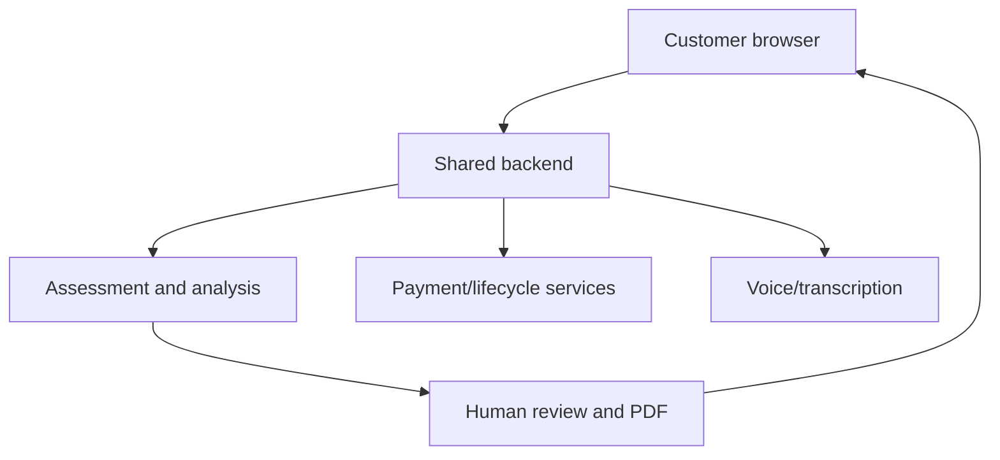

# BizMetria Legal and Data Baseline v0.1

**Task:** `LS-001 — Legal and Data Inventory Baseline` \
**Version:** `v0.1` \
**Status:** `APPROVED` \
**Owner workstream:** 11 — Legal, Privacy and Security \
**Prepared:** 2026-07-30 \
**Source baseline:** `main` at `9f589ba69aaa202ddb5890cfc9a5d56890b85dc8`

## 1. Purpose, scope, and legal-status notice

This document provides MVP legal issue-spotting, a data inventory, implementable privacy/security guardrails, and a register of decisions requiring qualified review. It is not final legal advice and does not approve a jurisdiction, Refund Policy, vendor, processor, retention period, contract, or legal conclusion.

It covers the currently approved journey:

1. bilingual public website;
2. free AI Opportunity Check;
3. contact and separate email/SMS consent;
4. deterministic free result;
5. one-time $299 checkout;
6. paid questionnaire;
7. English or Spanish voice interview;
8. AI analysis and human review;
9. PDF delivery and consultation;
10. optional, separately sold implementation.

Any new field, vendor, tracking technology, jurisdiction, use purpose, or customer-facing claim requires an update to this inventory before production use.

## 2. Current authoritative baseline

The following are approved product constraints:

- English and Spanish are first-class launch languages.
- English and Spanish use separate phone numbers and one shared backend.
- The free audit uses 11 questions plus a contact form.
- Email consent and optional SMS consent are separate.
- Contact, identity, industry, language, and promotion data do not affect the score.
- The score is not a financial valuation or a business-quality rating.
- The assessment is $299 one time, not a subscription.
- Implementation is separate.
- Every MVP paid report receives human review before delivery.

The final Refund Policy, consultation rules, vendors/processors, retention periods, technology stack, and detailed score table are still open.

## 3. Data-protection principles

Every implementation and vendor decision must apply these principles:

1. **Purpose limitation** — collect and use a field only for a documented product, support, security, accounting, or consent purpose.
2. **Data minimization** — do not request personal or business data merely because it might later be useful.
3. **Separation** — assessment evidence, contact data, consent evidence, payment state, and marketing eligibility are distinct data domains.
4. **Least privilege** — each role receives only the minimum access needed.
5. **Traceability** — material analysis and report statements link to evidence without copying unnecessary personal data.
6. **Determinism** — identity, contact, language, and marketing data never alter scoring.
7. **Transparency** — notice at collection explains categories, purposes, sharing, retention approach, rights, and contact path.
8. **User control** — marketing preferences and applicable privacy requests are actionable and auditable.
9. **Secure disposal** — expired or deleted data is removed from active systems and handled under a documented backup-expiration process.
10. **No production data in GitHub** — repositories contain synthetic fixtures only.

## 4. Data classification

| Class | Meaning | Examples | Default handling |
|---|---|---|---|
| `PUBLIC` | Intended for public display | Published site copy, public policies | Integrity control; no confidentiality requirement |
| `INTERNAL` | Non-public operational data with low direct individual impact | Template IDs, aggregate metrics, non-sensitive configuration | Authenticated access |
| `CONFIDENTIAL_BUSINESS` | Customer operational evidence | Workflows, systems, business problems, roadmap inputs | Encryption, least privilege, audit log |
| `PERSONAL` | Identifies or can reasonably relate to a person | Name, email, phone, IP address, voice/transcript | Notice, purpose, access, retention, deletion controls |
| `SENSITIVE_RESTRICTED` | High-impact or credential/payment/security material | Password hash, access token, payment token, security logs | Strongest access controls; never place secrets in logs or GitHub |
| `PROHIBITED_UNLESS_APPROVED` | Not needed for the current product | Full card number, government ID, health records, precise geolocation | Do not collect; escalate before any exception |

Customer operational details may be commercially sensitive even when they are not legally defined as personal information.

## 5. Field-level data inventory

### 5.1 Free assessment answers

All rows below are customer-provided, classified `CONFIDENTIAL_BUSINESS`, and accessible to the customer, authorized support, analysis services, and authorized human reviewers. They are not used for identity verification. Exact retention remains open; engineering must support order/lead-linked deletion and purpose-based expiration.

| Canonical field | Purpose | Score use | Minimization and deletion treatment |
|---|---|---|---|
| `business_type` | Recommendation context | None | Store category; avoid unnecessary free-text personal details |
| `team_size` | Operating-scale context | None in recovered baseline | Store canonical band, not employee names |
| `monthly_new_inquiries` | Volume context | None in recovered baseline | Store band, not lead lists |
| `lead_channels` | Channel-fragmentation context | Opportunity Breadth in recovered draft | Canonical IDs only |
| `first_response_speed` | Response-friction evidence | Lead Response and Follow-Up | Canonical ID only |
| `customer_tracking_system` | Systems/data maturity evidence | Systems and Data | Canonical ID only |
| `manual_work_areas` | Manual-burden evidence | Manual Work and breadth | Canonical IDs; reject duplicates; `none` exclusive |
| `unconverted_lead_follow_up` | Follow-up maturity evidence | Lead Response and Follow-Up/breadth | Canonical ID only |
| `primary_business_problem` | Stated priority context | Fixed-domain classification only | Canonical ID; tightly bound optional text if later approved |
| `desired_90_day_outcome` | Desired outcome context | Fixed-domain classification only | Canonical ID; tightly bound optional text if later approved |
| `improvement_urgency` | Timing priority | Strategic Priority and Urgency | Canonical ID only |

Unknown answer IDs must be rejected. Optional free text must not produce score points without an approved deterministic rule.

### 5.2 Contact, language, and consent fields

| Field | Class | Source | Purpose | Access | Retention/deletion treatment |
|---|---|---|---|---|---|
| `contact_name` | PERSONAL | User | Address result and account/order communications | Customer, support, fulfillment | Delete/anonymize on validated request subject to lawful exceptions |
| `business_name` | PERSONAL / CONFIDENTIAL_BUSINESS | User | Associate assessment with business | Customer, support, fulfillment | Same as assessment relationship |
| `business_website` | PERSONAL / PUBLIC_REFERENCE | User | Business context and optional research | Analysis/reviewer when authorized | Optional; delete with assessment unless separately retained lawfully |
| `email` | PERSONAL | User | Result delivery, account/order service, optional marketing | Support, lifecycle system | Marketing suppression may be retained after content deletion |
| `phone` | PERSONAL | User | Optional contact, voice/SMS routing if separately authorized | Support, voice/lifecycle system | Optional; delete when no longer required, preserving suppression evidence where lawful |
| `preferred_language` | PERSONAL preference | User | Presentation and service language | All customer-facing systems | Retain with active customer/lead record; no score impact |
| `email_consent` | PERSONAL consent evidence | User action | Determine marketing-email eligibility | Lifecycle/compliance/support | Preserve proof and later withdrawal/suppression record |
| `sms_consent` | PERSONAL consent evidence | User action | Determine marketing/automated-text eligibility | Lifecycle/compliance/support | Separate optional proof plus revocation/suppression record |
| `notice_version` | INTERNAL / consent evidence | System | Prove text shown at collection | Compliance/support | Preserve with consent record |
| `consent_timestamp` | PERSONAL metadata | System | Evidence of action timing | Compliance/support | Preserve with consent record |
| `consent_source_url` | PERSONAL metadata | System | Evidence of collection surface | Compliance/support | Preserve with consent record |
| `consent_ip` | PERSONAL | System | Fraud/consent evidence if justified | Restricted compliance/security | Collect only if counsel approves necessity; short, explicit retention |
| `consent_user_agent` | PERSONAL | System | Consent/fraud evidence if justified | Restricted compliance/security | Minimize; collect only if justified |
| `withdrawal_timestamp` | PERSONAL consent evidence | User/system | Prove revocation processing | Compliance/lifecycle | Preserve suppression evidence without continued marketing |

Supplying an email or phone number does not itself create marketing consent.

### 5.3 Free-result and scoring fields

| Field group | Source | Purpose | Access | Retention/deletion |
|---|---|---|---|---|
| `score_total`, five block scores, score level | Deterministic engine | Display free result and maintain regression/audit evidence | Customer, support, analytics in minimized form | Link to free assessment; delete/anonymize with lead where applicable |
| Detected opportunity areas | Deterministic engine | Display up to three general areas | Customer, support | Same as result |
| Score/rule version | System | Reproduce and audit result | Engineering, QA, support | Retain with result record |
| Validation errors | System | Support and abuse diagnosis | Engineering/support | Short operational retention; redact personal content |
| Locked-section exposure | System event | Funnel analytics | Product/analytics | Prefer pseudonymous event ID; aggregate after operational window |

### 5.4 Account, order, payment, and promotion data

| Field group | Class | Purpose | Storage boundary | Retention/deletion |
|---|---|---|---|---|
| Customer/account ID and authentication data | PERSONAL / SENSITIVE_RESTRICTED | Secure account and return access | Auth provider/shared backend | Passwords only as strong hashes or delegated auth; delete/disable through verified process |
| Order ID, amount, currency, status, timestamps | PERSONAL / accounting | Fulfillment, support, accounting | Backend/processor references | Retain as required for tax, accounting, disputes, and fraud; exact schedule requires counsel/accountant |
| Payment processor customer/payment intent IDs | SENSITIVE_RESTRICTED reference | Reconcile payment/webhooks/refunds | Backend and processor | Never store raw card data; retain references only as required |
| Promotion code ID and discount amount | INTERNAL / commercial | Calculate eligible price and attribution | Checkout/backend | Retain with order; no score impact |
| Billing address or tax data | PERSONAL | Processor/tax requirement if enabled | Prefer processor-hosted collection | Collect only fields actually required; legal retention to be decided |
| Webhook event ID and signature-validation result | SECURITY / INTERNAL | Idempotency and fraud protection | Backend logs/state | Retain per security/financial dispute schedule; no payload over-logging |

BizMetria must use processor-hosted payment collection so raw card numbers and card security codes do not enter BizMetria systems.

### 5.5 Paid questionnaire and interview

The final paid-questionnaire field list is not yet approved and belongs to `PS-004`. Before implementation, every field must be added to this inventory with purpose, required/optional status, classification, access, retention, and deletion.

Current allowed data classes are:

| Data | Source | Purpose | Access | Retention/deletion |
|---|---|---|---|---|
| Paid questionnaire answers | Customer | Gather operational evidence | Customer, analysis, reviewer, restricted support | Order-linked; purpose-based retention; field deletion/version rules required |
| Interview session metadata | Voice system | Route and recover interview | Voice/backend/support | Keep minimum timestamps/status/error metadata |
| Audio recording, if enabled | Customer voice | Transcription/review only if separately disclosed and consented | Restricted voice service and authorized review | Exact retention is high-risk and open; default should be shortest operational period |
| Transcript | Voice/transcription service | Analysis evidence and quality review | Analysis, reviewer, restricted support | Order-linked; deletion/export capability required |
| Structured interview facts | Analysis mapping | Language-neutral evidence | Analysis, reviewer | Order-linked; keep source references |
| Speaker/participant identifiers | User/system | Attribute evidence and access | Restricted fulfillment | Minimize to role/name needed; do not infer sensitive traits |
| Call consent/disclosure evidence | User/system | Prove recording/transcription notice and choice | Compliance/support | Preserve version, language, timestamp, result, and withdrawal/termination state |

Do not request trade secrets, customer lists, employee records, financial account credentials, protected health data, government IDs, or other sensitive material unless a later documented necessity and qualified review authorize it.

### 5.6 Analysis, human review, report, and consultation

| Data | Source | Purpose | Access | Retention/deletion |
|---|---|---|---|---|
| Normalized evidence | Structured inputs/interview | Support analysis | Analysis and reviewer | Order-linked; retain source/version links |
| Facts, inferences, assumptions, unknowns | Analysis engine | Prevent unsupported conclusions | Analysis and reviewer; approved subset to customer | Delete/anonymize with assessment subject to lawful exceptions |
| Recommendation objects | Analysis engine | Build prioritized result | Reviewer and customer after approval | Versioned with report |
| Prompt/model/rule versions | System | Reproducibility and audit | Engineering/QA/reviewer | Retain identifiers; do not log hidden credentials |
| Draft reports | System/reviewer | Review and regeneration | Reviewer; restricted support | Limit old draft retention; record approval lineage |
| Review decision, reviewer ID, checklist version, edits | Reviewer/system | Enforce mandatory MVP review | Restricted operations/audit | Retain with report version |
| Approved PDF | System/reviewer | Deliver purchased product | Customer and authorized support | Order-linked access; revocation/deletion rules required |
| Delivery events | System | Confirm delivery and support | Support/audit | Retain minimum event evidence |
| Consultation booking and outcome | Customer/staff | Schedule and complete consultation | Customer, authorized consultant/support | Minimize notes; no unstructured sensitive notes by default |
| Implementation-interest state | Customer/staff | Separate follow-up | Sales/support with permission | Separate lifecycle purpose and access |

Customer data must not be used to train general-purpose models unless separately authorized through an approved, specific, informed process and compatible vendor contract. Default vendor configuration should disable training on BizMetria customer content where available.

### 5.7 Website, analytics, security, and support

| Data | Purpose | Access | Minimization/retention |
|---|---|---|---|
| Session ID and essential cookies | Secure session and progress recovery | Backend/security | First-party, limited lifetime, no advertising use |
| Analytics event name, timestamp, page/state, language, campaign IDs | Product/attribution measurement | Product/analytics | Pseudonymous ID; exclude questionnaire text, transcript, email, phone |
| IP address and device/browser metadata | Security, abuse, coarse diagnostics | Restricted security | Truncate/minimize where feasible; short retention |
| Authentication and authorization log | Detect unauthorized access | Restricted security/audit | Retention tied to incident/dispute needs |
| Rate-limit/abuse signal | Prevent automated abuse | Security/backend | Do not create broad behavioral profiles |
| Error/trace ID | Reliability/support | Engineering/support | No secrets or raw personal payloads |
| Support ticket and attachments | Resolve customer request | Restricted support/reviewer as needed | Warn against sensitive uploads; delete when no longer needed |
| Privacy request record | Validate and fulfill rights | Restricted compliance | Preserve request status, verification method, outcome, and lawful exceptions |
| Backup copies | Availability/recovery | Restricted infrastructure | Encrypted; defined expiration; deletion propagates on restore procedure |

No analytics or error tool may receive raw assessment answers, transcript text, audio, email, phone, payment details, or report content by default.

## 6. Data-flow and processor map

Each external service is provisional until `MC-004`. Before onboarding a vendor, record:

- legal entity and service;
- data categories and purposes;
- controller/business/service-provider/processor role as reviewed by counsel;
- subprocessors and processing locations;
- training/secondary-use terms;
- retention and deletion capability;
- encryption and access controls;
- breach-notification commitment;
- audit/compliance evidence;
- contract/DPA status;
- account owner and credential owner;
- export and replacement plan.

## 7. Consent and communication baseline

### 7.1 Service communications

Operational messages required to deliver a requested free result, paid order, security notice, or support response must be distinguishable from marketing. The system must record the message purpose and template version.

### 7.2 Marketing email

Recommended baseline:

- use a separate, unchecked marketing-email choice where consent is the chosen basis;
- record the exact notice, version, timestamp, and source;
- use accurate sender/header and subject information;
- identify advertising where required;
- include a valid physical postal address;
- provide a clear unsubscribe mechanism;
- apply opt-out promptly and maintain a suppression record;
- ensure vendors and affiliates obey the same suppression state.

The final legal basis and form wording require counsel review for every launch jurisdiction. Commercial email must at minimum be designed for CAN-SPAM compliance.

### 7.3 SMS and automated calls

SMS permission must:

- be separate from email permission and from accepting Terms;
- remain optional for receiving the free result;
- name BizMetria as the sender;
- describe message purpose and expected frequency in plain language;
- state that consent is not a condition of purchase where required;
- include message/data-rate and HELP/STOP treatment where applicable;
- preserve the exact disclosure and affirmative action;
- support revocation by reasonable means and propagate suppression across vendors;
- prevent marketing or automated texts before the required consent state.

Supplying a phone number is not SMS consent. Transactional and marketing text purposes must be modeled separately.

### 7.4 Voice interview, recording, and transcription

Before any recording or transcription:

- provide a clear disclosure in the selected language;
- identify BizMetria and the purpose of the interview;
- state whether audio is recorded, transcribed, analyzed by AI, and reviewed by people;
- identify the applicable policy/notice version;
- obtain and record the required affirmative consent before capture begins;
- provide a termination/support path if consent is not given;
- do not rely only on a buried Terms clause.

California Penal Code § 632 creates all-party-consent risk for confidential communications, and other states vary. Qualified counsel must approve the recording/transcription flow, interstate-call rule, fallback path, and retention before launch.

### 7.5 Cookies and analytics

- Essential session/security cookies must be described.
- Non-essential analytics/advertising tools require a jurisdiction and vendor review before activation.
- If sale/sharing or cross-context behavioral advertising occurs, applicable opt-out and Global Privacy Control handling must be implemented.
- No tracker may collect paid questionnaire, transcript, report, or payment-form content.

## 8. Notice, privacy rights, and request handling

### 8.1 Notice surfaces

| Surface | Required notice purpose |
|---|---|
| Website footer | Privacy Policy, Terms, contact path, applicable choices |
| Free-check start | Assessment purpose and data-use summary |
| Contact form | Notice at collection; separate communication choices |
| Free result | Score limitation and marketing preference access |
| Checkout | Price, one-time nature, scope/exclusions, Refund Policy when approved, processor boundary |
| Paid questionnaire | Sensitive-data warning, required/optional fields, save/resume and deletion treatment |
| Voice interview | Recording/transcription/AI/human-review disclosure and consent |
| Report | Evidence limitations, no guarantee, no legal/tax/financial advice |
| Consultation booking | Scope, participants, scheduling/no-show rules once approved |
| Privacy request page | Access/correction/deletion/opt-out/appeal or applicable request paths |

### 8.2 Request workflow

The platform must support a documented workflow for:

1. receiving a request;
2. determining applicable law and request type;
3. verifying identity proportionately without collecting excessive new data;
4. locating data across vendors and backups;
5. honoring, denying with a documented basis, or requesting clarification;
6. notifying processors/vendors;
7. recording deadlines, extensions, outcome, and appeal where applicable;
8. preventing discriminatory treatment for exercising applicable rights;
9. maintaining minimal proof of completion.

At minimum, system design must be capable of access/export, correction, deletion, communication opt-out, and restriction of unauthorized sale/sharing. Applicability and statutory response periods require counsel review.

### 8.3 California baseline

- CalOPPA can require a conspicuously posted privacy policy for commercial websites or online services collecting personally identifiable information from California consumers.
- If BizMetria meets CCPA/CPRA applicability thresholds, notice-at-collection, rights handling, correction/deletion/know/opt-out treatment, vendor contracts, sensitive-data treatment, and Global Privacy Control behavior require implementation.
- California regulations effective in 2026 add or update requirements involving risk assessments, cybersecurity audits, and certain automated decisionmaking activities for covered businesses. Applicability must be assessed before production and whenever scale/use cases change.

The MVP should implement transparent, rights-capable architecture even if counsel concludes that a particular statute does not yet apply.

## 9. Claims and disclaimer inventory

| Surface/claim | Required treatment | Prohibited treatment |
|---|---|---|
| AI Opportunity Score | “Not a financial valuation or rating of business quality” | Implied business value, creditworthiness, guaranteed performance |
| Opportunity areas | General operational categories based on answers | Invented losses, certainty beyond evidence |
| Paid assessment offer | $299 one time; implementation separate | Subscription implication or hidden implementation dependency |
| Recommendations | Decision-support with evidence/assumption labels | Legal, tax, accounting, investment, or guaranteed ROI advice |
| Impact vs. Effort Matrix | Relative planning aid | Precise ROI/payback claim without verified data |
| 30–90 day roadmap | Recommended sequence | Promise that results will occur within 30–90 days |
| Human review | Quality-control step during MVP | Claim that review certifies legal/compliance/financial accuracy |
| Consultation | Explain report and priorities within approved scope | Free implementation or regulated professional advice |
| Testimonials/case studies | Truthful, permissioned, representative context | Fabricated, atypical-as-typical, undisclosed material connection |
| Promotions | Accurate eligibility, price, expiry, and limits | False scarcity or pre-advertising the $199 late-reactivation discount |

Marketing, lifecycle messages, report templates, and consultation scripts must use the same claims matrix.

## 10. Retention and deletion baseline

Exact periods are not approved. `LS-002`/`LS-003`, counsel, accounting requirements, vendor capability, and operational needs must produce a final schedule.

Until then, implementation requirements are:

- every table/object has a data owner and retention class;
- retention is event-based, not “keep forever”;
- raw audio receives the shortest operational retention and cannot default to indefinite storage;
- transcripts, assessment evidence, drafts, and approved reports have separate retention classes;
- marketing suppression evidence may remain after content deletion to prevent future contact;
- financial transaction records are separated from assessment content;
- security logs are retained only for a documented detection/investigation period;
- backups are encrypted, expire automatically, and have a deletion-on-restore procedure;
- legal hold overrides deletion only through a documented authorized process;
- deletion jobs are idempotent, auditable, and cover processors.

Required schedule columns for the later approved policy:

| Data class | Trigger | Active retention | Backup expiry | Lawful exception | Deletion/anonymization owner |
|---|---|---|---|---|---|
| Lead/free assessment | Last activity or request | OPEN | OPEN | OPEN | Lifecycle/Privacy |
| Consent/suppression evidence | Consent/withdrawal | OPEN | OPEN | Compliance proof | Lifecycle/Privacy |
| Account/order | Closure/transaction | OPEN | OPEN | Tax, dispute, fraud | Finance/Privacy |
| Paid evidence/transcript | Delivery/closure | OPEN | OPEN | Dispute/legal hold | Fulfillment/Privacy |
| Raw audio | Transcription/review completion | OPEN; minimize | OPEN | Dispute/legal hold only if approved | Voice/Privacy |
| Draft/approved report | Delivery/closure | OPEN | OPEN | Contract/dispute | Fulfillment/Privacy |
| Analytics | Event date | OPEN; aggregate early | OPEN | None expected | Product/Privacy |
| Security logs | Event date | OPEN | OPEN | Incident/legal hold | Security |
| Support records | Ticket closure | OPEN | OPEN | Dispute | Support/Privacy |

No `OPEN` period may silently become an indefinite production default.

## 11. Security and access-control baseline

### 11.1 Roles

Minimum role separation:

- customer;
- support;
- human reviewer;
- consultant;
- sales/implementation;
- finance/refund operator;
- privacy/compliance operator;
- engineering operator;
- security administrator.

High-risk actions such as report approval, refund execution, data export/deletion, role change, secret access, and production configuration change require explicit authorization and audit.

### 11.2 Required controls

- Strong authentication; MFA for staff and privileged access.
- Server-side authorization on every protected object.
- Encryption in transit and at rest using maintained platform controls.
- Secrets in a managed secret store, never source control or client bundles.
- Environment separation for development, staging, and production.
- Synthetic test data only outside approved production workflows.
- Input validation, output encoding, CSRF/session protection, rate limits, and abuse controls.
- Signed, replay-protected, idempotent webhooks.
- Audit logs for access, role changes, approvals, exports, deletions, refunds, and sensitive configuration.
- Log redaction and structured error handling.
- Dependency and vulnerability management.
- Encrypted backups, restore tests, and access review.
- Incident response, breach assessment, notification decision process, and evidence preservation.
- Periodic access recertification and immediate offboarding.

The FTC’s published security guidance supports inventorying data, minimizing it, controlling access, protecting it, disposing of it safely, and planning for incidents. These principles are engineering requirements, not only policy text.

## 12. Vendor and model due diligence

No vendor is approved in this document.

Before production data reaches any provider, review:

- service purpose and least data required;
- security documentation and incident history;
- contract, DPA, confidentiality, and breach terms;
- subprocessors, locations, and cross-border transfers;
- model-training and human-review defaults;
- content retention and deletion controls;
- access logs and role controls;
- exportability and vendor replacement;
- availability, rate limits, recovery, and support;
- whether customer content can appear in vendor logs;
- whether account settings can disable training or secondary use;
- payment processor scope and PCI boundary where relevant.

Provider terms must match the public Privacy Policy and actual product behavior.

## 13. Policy issue register

| ID | Issue | Risk | Required owner/review | Blocking gate |
|---|---|---|---|---|
| `LS-ISSUE-001` | Entity, launch jurisdictions, and governing-law/venue choice | Cannot finalize Terms or applicability | Owner + qualified counsel | `MC-003` / public launch |
| `LS-ISSUE-002` | Final Refund Policy and fulfillment start point | Checkout, disputes, chargebacks | Product + counsel | `MC-003` |
| `LS-ISSUE-003` | Voice recording/transcription consent across states | Recording-law exposure | Counsel + Voice + UX | `LS-002` / `MC-004` |
| `LS-ISSUE-004` | TCPA/SMS/automated-call classification and consent wording | Messaging liability | Counsel + Lifecycle | `LS-002` |
| `LS-ISSUE-005` | CAN-SPAM and lifecycle message classification | Email compliance | Counsel + Lifecycle | `LS-002` |
| `LS-ISSUE-006` | CalOPPA privacy-policy requirements | Public-site requirement | Counsel + UX | `LS-004` |
| `LS-ISSUE-007` | CCPA/CPRA threshold and 2026 regulation applicability | Rights, notices, risk assessment, ADMT/security duties | Counsel/Privacy | Before production and scale changes |
| `LS-ISSUE-008` | Other U.S. state comprehensive privacy laws | Multi-state rights and contracts | Counsel/Privacy | Before broad advertising |
| `LS-ISSUE-009` | Exact retention/deletion schedule | Over-retention and incomplete deletion | Privacy + Security + Finance + counsel | `LS-003` |
| `LS-ISSUE-010` | Vendor roles, DPAs, training, subprocessors, transfers | Secondary use and breach risk | Legal + Backend | `MC-004` |
| `LS-ISSUE-011` | Age eligibility and minor handling | Additional consent/privacy obligations | Owner + counsel + UX | `MC-003` / `LS-002` |
| `LS-ISSUE-012` | Accessibility and language equivalence of legal text | Invalid/inadequate notice risk | Legal + UX + localization reviewer | `LS-004` |
| `LS-ISSUE-013` | Testimonials, endorsements, savings, ROI claims | Deceptive-advertising risk | Legal + Marketing | `MS-001` |
| `LS-ISSUE-014` | Tax/accounting record requirements | Retention/refund conflict | Accountant + counsel | `MC-003` |
| `LS-ISSUE-015` | Incident and breach-notification jurisdictions | Delayed or incorrect response | Security + counsel | `LS-003` |

## 14. Security and privacy risk register

| Risk | Likelihood before controls | Impact | Required mitigation | Verification |
|---|---|---|---|---|
| Raw transcript/audio leaks through logs | Medium | High | Payload redaction, restricted storage, short retention | Log tests and access review |
| Staff sees unrelated customer reports | Medium | High | Object-level authorization and least privilege | Authorization tests |
| AI/vendor uses customer content for training | Medium | High | Contract/settings review and approved provider configuration | Vendor evidence |
| Marketing sent without valid permission | Medium | High | Separate consent states and suppression propagation | Lifecycle tests |
| Recording begins before disclosure/consent | Medium | High | Pre-capture consent state machine | Paired EN/ES call tests |
| Report delivered without human approval | Medium | High | Technical approval gate and audit event | Negative E2E test |
| Analytics captures personal/assessment data | Medium | High | Allowlisted event properties and scanner | Analytics payload audit |
| Payment webhook replay changes order twice | Medium | Medium | Signature verification and idempotency | Replay tests |
| Deleted data returns from backup | Medium | High | Backup expiry and deletion-on-restore runbook | Restore test |
| Spanish disclosure differs materially | Medium | High | Legal localization and parity fixtures | Bilingual review |
| Unsupported guarantee appears in output | Medium | High | Claim filters, review checklist, release tests | Prompt/output regression |
| Excessive free text captures sensitive data | Medium | High | Bounded fields, warnings, redaction and reviewer escalation | Form/schema tests |

## 15. Implementation acceptance criteria

`LS-001` is satisfied when downstream work can demonstrate:

1. Each currently known field appears in the inventory or is explicitly prohibited.
2. Future paid-questionnaire fields cannot ship without inventory metadata.
3. Email and SMS consent are separate, versioned, timestamped states.
4. Voice recording/transcription cannot start before the required language-specific disclosure and consent.
5. Score, report, and marketing disclaimers map to concrete surfaces.
6. Identity/contact/language/promotion data cannot affect scoring.
7. Raw card data does not enter BizMetria systems.
8. Reports cannot be delivered without audited human approval.
9. Analytics and logs exclude raw customer content by default.
10. Role-based access, export, correction, deletion, suppression, and audit events are testable.
11. Vendors cannot receive production data before due diligence and contract/configuration review.
12. No unresolved retention period, legal conclusion, or Refund Policy is presented as approved.

## 16. Official reference set

Current issue-spotting was checked against official sources available on 2026-07-30:

- [California Attorney General — CCPA overview](https://oag.ca.gov/privacy/ccpa)
- [California Privacy Protection Agency — current law and regulations](https://cppa.ca.gov/regulations/)
- [California Privacy Protection Agency — 2026 CCPA updates](https://cppa.ca.gov/regulations/ccpa_updates.html)
- [California Attorney General — privacy-policy guidance and CalOPPA description](https://oag.ca.gov/privacy/facts/online-privacy/privacy-policy)
- [California Penal Code § 632](https://leginfo.legislature.ca.gov/faces/codes_displaySection.xhtml?lawCode=PEN&sectionNum=632)
- [FTC — CAN-SPAM compliance guide](https://www.ftc.gov/business-guidance/resources/can-spam-act-compliance-guide-business)
- [FCC — Telephone Consumer Protection Act rules](https://www.fcc.gov/sites/default/files/tcpa-rules.pdf)
- [FCC — consent revocation order](https://docs.fcc.gov/public/attachments/FCC-24-24A1.pdf)
- [FTC — Start with Security](https://www.ftc.gov/business-guidance/resources/start-security-guide-business)
- [FTC — Protecting Personal Information](https://www.ftc.gov/business-guidance/resources/protecting-personal-information-guide-business)

These sources do not replace advice for BizMetria’s actual entity, vendors, jurisdictions, facts, or launch configuration.

## 17. Handoff Summary

- **Task:** `LS-001 — Legal and Data Inventory Baseline`
- **Status:** `APPROVED`
- **Files changed:** Legal/Data baseline plus Workstream 11 state, task queue, artifact index, handoff, and changelog.
- **Decisions proposed:** Data classification, role/access baseline, field-inventory metadata, consent evidence model, rights workflow, vendor checklist, security controls, and policy/risk registers for downstream review.
- **Decisions approved:** Existing product constraints in `DEC-001`–`DEC-013`, `DEC-015`, and `DEC-016`; no new legal or commercial decision.
- **Open questions:** Refund Policy, entity/jurisdictions, recording/transcription consent, TCPA/email treatment, age eligibility, CCPA/other-state applicability, exact retention, vendor contracts/roles, and incident obligations.
- **Dependencies:** Approved `G0`, Master Brief, Decision Log, recovered journey and fields, parallel `PS-001`; later `PS-004`, `FA-001`, vendor ADRs, and owner decisions.
- **Validation performed:** Known-field coverage, purpose/access/retention/deletion matrix review, separate-consent review, disclaimer-surface map, security control testability, open-decision scan, official-source check, and Handoff completeness.
- **Recommended next task:** Use the approved LS-001 baseline with PS-001 for `PS-002`; then develop `LS-002 — Consent, Claims, and Data Requirements` only after its named dependencies are approved.
